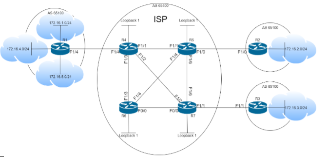

Тема: Проектиране на корпоративна мрежа с отдалечени офиси
посредством технологията DMVPN, анализ и менажиране на преносната
среда

2. Топология с наименования на устройствата,
обозначени мрежови протоколи между тях, роли и IP
адреси.
3. Производител, серия и точен модел на
използваните устройства. Ако в проекта е използван
някакъв софтуер (пример: VLC Media Player, Wireshark etc.)
да се упомене.
4. Кратко описание на проекта и по-обща идея за
начина му на работа(повърхностно обяснение без много
технически термини).
5. Линк към заключен(да не могат да се извършват
copy, paste и други операции върху него) PDF файл, който
да съдържа документацията на дипломната
работа/проекта.
