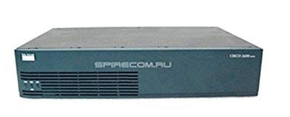

Тема: Проектиране на корпоративна мрежа с отдалечени офиси
посредством технологията DMVPN, анализ и менажиране на преносната
среда

Маршрутизаторите са от серията Cisco 2691 

4. Кратко описание на проекта и по-обща идея за
начина му на работа(повърхностно обяснение без много
технически термини).
5. Линк към заключен(да не могат да се извършват
copy, paste и други операции върху него) PDF файл, който
да съдържа документацията на дипломната
работа/проекта.
